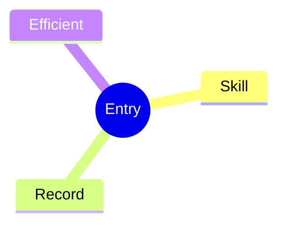

# All Notes Entry Point here

## Entries
* [Efficient](Efficient/EfficientEntry.md)
* [Record](Record/RecordEntry.md)
* [Skill](Skill/SkillEntry.md)

```mermaid
mindmap
root((Entry))
  Skill
  Record
  Efficient
```
