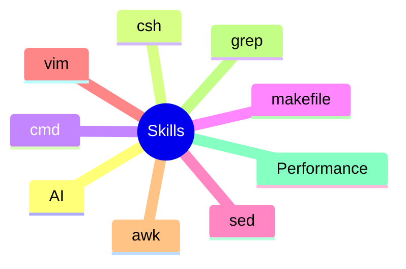

# Skills

* [AI](AI/AIEntry.md)
* [CShell](CShell/CShellEntry.md)
* [Cmd](Cmd/CmdEntry.md)
* [Makefile](Makefile/MakefileEntry.md)
* [Sed](Sed/SedEntry.md)
* [Vim](Vim/VimEntry.md)
* [awk](awk/AwkEntry.md)
* [grep](grep/GrepEntry.md)
* [Performance](Performance/PerformanceEntry.md)

